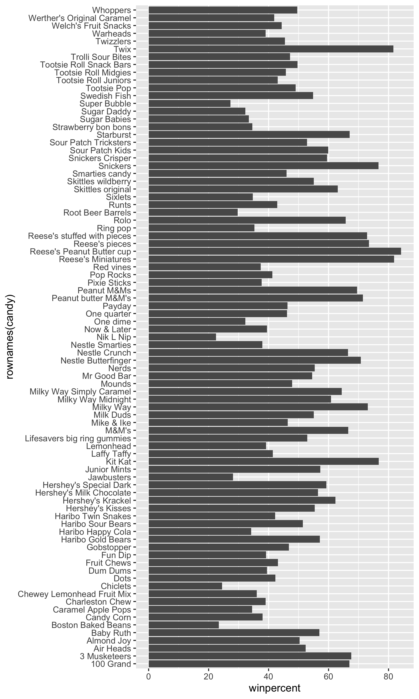

## Background

In this mini-project, we will explore FiveThirtyEight’s Halloween Candy dataset. FiveThirtyEight, sometimes rendered as just 538, is an American website that focuses mostly on opinion poll analysis, politics, economics, and sports blogging. They recently ran a rather large poll to determine which candy their readers like best.

## Importing candy data

First, we must get the data from the FiveThirtyEight GitHub repo. We can either read from the URL directly or download this candy-data.csv file and place it in the project directory. Use the function `url` to load in the webadress data into the code. Use function `read.csv` to load data from a CSV (comma‑separated values) file into R as a data frame.

```{r}
candy_file <- url("https://raw.githubusercontent.com/fivethirtyeight/data/master/candy-power-ranking/candy-data.csv")
candy<- read.csv(candy_file, row.names=1)
head(candy)
```

> Q1. How many different candy types are in this dataset?

There are `r nrow(candy)` rows in this data set

> Q2. How many fruity candy types are in the dataset?

```{r}
sum(candy$fruity)
```
There are 38 fruit candy types in this dataset.

> Q3. What is your favorite candy (other than Twix) in the dataset and what is it’s winpercent value?

My favorite candy in the data set are M&Ms. 

```{r}
candy["M&M's", ]$winpercent
```
The winpercent value is 66.57%.

> Q4. What is the winpercent value for “Kit Kat”?

The winpercent value for Kit Kat is:

```{r}
candy["Kit Kat", ]$winpercent
```

> Q5. What is the winpercent value for “Tootsie Roll Snack Bars”?

You can also find winpercent value like this:

```{r}
candy["Tootsie Roll Snack Bars", "winpercent"]
```

**NOTE** There is a useful skim() function in the skimr package that can help give you a quick overview of a given dataset. Let’s install this package and try it on our candy data.

```{r}
library("skimr")
skim(candy)
```

> Q6. Is there any variable/column that looks to be on a different scale to the majority of the other columns in the dataset?

"winpercent", is on a 0–100 scale, while most other variables are binary (0/1).

> Q7. What do you think a zero and one represent for the candy$chocolate column?

```{r}
candy$chocolate
```

1 contains chocolate (1 = "TRUE"), while 0 does not contain chocolate (0 = "FALSE").

## Exploratory analysis
A good place to start any exploratory analysis is with a histogram. You can do this most easily with the base R function hist(). Alternatively, you can use ggplot() with geom_hist().

> Q8. Plot a histogram of winpercent values using both base R an ggplot2.

Here is a plot using just base R function `hist()`:

```{r}
hist(candy$winpercent, breaks = 20)
```

Here is a plot with the ggplot function:

```{r}
library(ggplot2)

ggplot(candy, 
       aes(x = winpercent)) +
  geom_histogram(bins = 20, fill = "skyblue", color = "black")
```

> Q9. Is the distribution of winpercent values symmetrical?

No... it is not quite symmetrical, it leans more towards the left side, towards a 40 winpercent "center".

> Q10. Is the center of the distribution above or below 50%?

```{r}
mean(candy$winpercent)
```
Slightly above 50%

```{r}
summary(candy$winpercent)
```

```{r}
ggplot(candy, 
       aes(x = winpercent)) +
  geom_boxplot()
```

> Q11. On average is chocolate candy higher or lower ranked than fruit candy?

Steps to solve this:
1. Find all chocolate candy in the dataset
2. Extract or find their winpercent values
3. Calculate the mean of these values
4. Find all fruit candy
5. Find their winpercent values
6. Calculate the mean of these values

```{r}
choc.candy <- candy[candy$chocolate==1, ]
choc.win <- choc.candy$winpercent
mean(choc.win)
```
```{r}
fruit.candy <- candy[candy$fruity==1, ]
fruit.win <- fruit.candy$winpercent
mean(fruit.win)
```

Can also do it all together like this:

```{r}
mean(candy$winpercent[candy$chocolate == 1])
mean(candy$winpercent[candy$fruity == 1])
```

Chocolate candy, on average, is ranked higher than fruit candy.

> Q12. Is this difference statistically significant?

```{r}
t.test(
  candy$winpercent[candy$chocolate == 1],
  candy$winpercent[candy$fruity == 1])
```
pvalue = 2.871e-08. The difference is statistically significant (p < 0.05).

## Overall Candy Rankings

Let’s use the base R `order()` function together with `head()` to sort the whole dataset by `winpercent`. Or if you have been getting into the tidyverse and the dplyr package you can use the `arrange()` function together with `head()` to do the same thing and answer the following questions:

> Q13. What are the five least liked candy types in this set?

```{r}
y <- c("z", "c", "a")
sort(y)
```
```{r}
inds <- order(candy$winpercent)
head(candy[inds, ], 5)
```

> Q14. What are the top 5 all time favorite candy types out of this set? 

```{r}
head(candy[order(-candy$winpercent), ], 5)
```

> Q15. Make a first barplot of candy ranking based on winpercent values.

```{r}
ggplot(candy) +
  aes(winpercent, rownames(candy)) +
  geom_col()

ggsave("barplot1.png", height=10, width=6)
```


> Q16. This is quite ugly, use the reorder() function to get the bars sorted by winpercent?

```{r}
ggplot(candy) +
  aes(winpercent, 
      reorder(rownames(candy), winpercent)) +
  geom_col() +
  ylab("") # turn off Y-label that we don't need

ggsave("barplot2.png", height=10, width=6)
```


## Time to add some useful color
Let’s setup a color vector (that signifies candy type) that we can then use for some future plots. We start by making a vector of all black values (one for each candy). Then we overwrite chocolate (for chocolate candy), brown (for candy bars) and red (for fruity candy) values.

First, set up a vector of the colors:
```{r}
my_cols <- rep("black", nrow(candy))
my_cols[candy$chocolate==1] <- "chocolate"
my_cols[candy$bar==1] <- "brown"
my_cols[candy$fruity==1] <- "pink"
my_cols
```


```{r}
ggplot(candy) +
  aes(winpercent, 
      reorder(rownames(candy), winpercent)) +
  geom_col(fill=my_cols) +
  ylab("")
```

> Q17. What is the worst ranked chocolate candy?

Sixlets (worst chocolate)

> Q18. What is the best ranked fruity candy?

Starburst

## Taking a look at pricepercent

Make a plot of winpercent vs the pricepercent. We can use the **grepel** package for better label placement:

```{r}
library(ggrepel)

ggplot(candy) +
  aes(x=winpercent, y=pricepercent, label=rownames(candy)) +
  geom_point(col=my_cols)+
   geom_text_repel(col=my_cols, size=3.3, max.overlaps = 5)
```

> Q19. Which candy type is the highest ranked in terms of winpercent for the least money - i.e. offers the most bang for your buck?

Reese’s Miniatures — very high winpercent with relatively low pricepercent.

> Q20. What are the top 5 most expensive candy types in the dataset and of these which is the least popular?

```{r}
ord <- order(candy$pricepercent, decreasing = TRUE)
head( candy[ord,c(11,12)], n=5 )
```

Nik L Nip is the least popular.

## Exploring the correlation structure
Now that we’ve explored the dataset a little, we’ll see how the variables interact with one another. We’ll use correlation and view the results with the corrplot package to plot a correlation matrix.

```{r}
library(corrplot)
cij <- cor(candy)
corrplot(cij)
```

> Q22. Examining this plot what two variables are anti-correlated (i.e. have minus values)?

*chocolate* and *fruity*

> Q23. Similarly, what two variables are most positively correlated?

*chocolate* and *bar*

## Principal Component Analysis
Let’s apply PCA using the `prcomp()` function to our candy dataset remembering to set the `scale=TRUE` argument.

```{r}
pca <- prcomp(candy, scale = TRUE)
summary(pca)
```

```{r}
plot(pca$x[,1:2], col = my_cols, pch = 16)
```

ggplot PCA:

```{r}
ggplot(pca$x) +
  aes(PC1, PC2, label = rownames(pca$x)) +
  geom_point(col=my_cols) +
  geom_text_repel(col=my_cols)+
  labs(title="PCA candy space map",
       subtitle="Colored by type: chocolate bar (dark brown), chocolate other (light brown), fruity (red), other (black)",
       caption="Data from 538")
```

> Q24. Complete the code to generate the loadings plot above. What original variables are picked up strongly by PC1 in the positive direction? Do these make sense to you? Where did you see this relationship highlighted previously?

```{r}
ggplot(pca$rotation) +
  aes(x = PC1, y = reorder(rownames(pca$rotation), PC1)) +
  geom_col()
```
PC1 is driven positively by chocolate, bar, peanuty & almondy.

## Summary
Starting with basic data import and exploration, you characterized the structure of the candy dataset and identified key variables. You then built increasingly sophisticated visualizations—from simple histograms to ranked bar plots to labeled scatter plots—to reveal patterns in candy popularity and pricing.


> Q25. Based on your exploratory analysis, correlation findings, and PCA results, what combination of characteristics appears to make a “winning” candy? How do these different analyses (visualization, correlation, PCA) support or complement each other in reaching this conclusion?

Winning candies tend to be chocolate-based, often bars, frequently containing peanuts, and not fruity.
This pattern is supported by:
- Rankings (top candies are chocolate bars)
- Correlation (chocolate vs fruity split)
- PCA (PC1 separates chocolate from fruity)