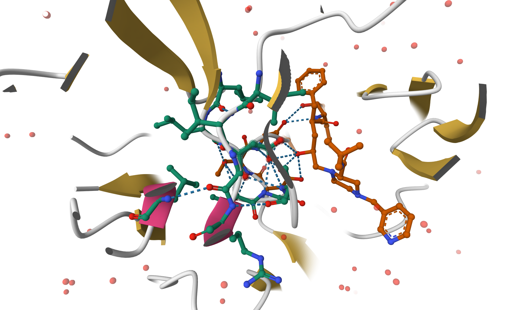

## 1: Introduction to the RCSB Protein Data Bank (PDB)

The PDB archive is the major repository of information about the 3D structures of large biological molecules, including proteins and nucleic acids. Understanding the shape of these molecules helps to understand how they work. This knowledge can be used to help deduce a structure’s role in human health and disease, and in drug development. The structures in the PDB range from tiny proteins and bits of DNA or RNA to complex molecular machines like the ribosome composed of many chains of protein and RNA.

In the first section of this lab we will interact with the main US based PDB website

>**Note** The “Analyze” > “PDB Statistics” > “by Experimental Method and Molecular Type” on the PDB home page should allow you to determine most of these answers. 

## PDB statistics

```{r}
library(tidyverse)
pdb <- read.csv("pdb_stats.csv")
head(pdb)
```

```{r}
colnames(pdb)
```

> Q1: What percentage of structures in the PDB are solved by X-Ray and Electron Microscopy.

```{r}
total_structures <- sum(pdb$Total)

xray_count <- sum(pdb$X.ray)

em_count <- sum(pdb$EM)

xray_percent <- (xray_count / total_structures) * 100
em_percent <- (em_count / total_structures) * 100

xray_percent
em_percent
```

Approximately 81% of structures in the PDB were solved using X-ray diffraction, while about 13% were solved using electron microscopy.

> Q2: What proportion of structures in the PDB are protein?

```{r}
total_structures <- sum(pdb$Total)

protein_structures <- sum(
  pdb$Total[grepl("Protein", pdb$Molecular.Type)]
)

protein_proportion <- protein_structures / total_structures

protein_proportion
```

Approximately 98% of structures in the PDB contain protein.

> Q3: Type HIV in the PDB website search box on the home page and determine how many HIV-1 protease structures are in the current PDB?

A search of the RCSB Protein Data Bank for “HIV-1 protease” returns 1,108 structures in the current PDB.

## The PDB format
Now download the “PDB File” for the HIV-1 protease structure with the PDB identifier 1HSG. On the website you can “Display” the contents of this “PDB format” file.

> Q4: Water molecules normally have 3 atoms. Why do we see just one atom per water molecule in this structure?

Water molecules normally contain three atoms, but only one atom is visible in this structure because hydrogen atoms are not typically resolved in X-ray crystallography. As a result, only the oxygen atom of each water molecule is included in the PDB file.

> Q5: There is a critical “conserved” water molecule in the binding site. Can you identify this water molecule? What residue number does this water molecule have

A conserved water molecule is present in the HIV-1 protease active site near the bound ligand. This water molecule is labeled as HOH and has residue number 308 in the PDB file.

> Q6: Generate and save a figure clearly showing the two distinct chains of HIV-protease along with the ligand. You might also consider showing the catalytic residues ASP 25 in each chain and the critical water (we recommend “Ball & Stick” for these side-chains). Add this figure to your Quarto document.
Discussion Topic: Can you think of a way in which indinavir, or even larger ligands and substrates, could enter the binding site?



**Figure 1.** HIV-1 protease (PDB ID: 1HSG) showing the two distinct protein chains in cartoon representation with the bound ligand indinavir displayed in ball-and-stick form. The catalytic residues Asp 25 in each chain and the conserved water molecule (HOH 308) are highlighted.

## Introduction to Bio3D in R

Bio3D is an R package for structural bioinformatics. Features include the ability to read, write and analyze biomolecular structure, sequence and dynamic trajectory data.

In your existing Rmarkdown document load the Bio3D package by typing in a new code chunk

```{r}
library(bio3d)
```

To read a single PDB file with Bio3D we can use the read.pdb() function. The minimal input required for this function is a specification of the file to be read. This can be either the file name of a local file on disc, or the RCSB PDB identifier of a file to read directly from the on-line PDB repository. For example to read and inspect the on-line file with PDB ID 1HSG:

```{r}
pdb <- read.pdb("1hsg")
```

> Q7: How many amino acid residues are there in this pdb object? 

198

>Q8: Name one of the two non-protein residues? 

HOH

>Q9: How many protein chains are in this structure? 

2

Note that the attributes (+ attr:) of this object are listed on the last couple of lines. To find the attributes of any such object you can use:

```{r}
attributes(pdb)
```

To access these individual attributes we use the dollar-attribute name convention that is common with R list objects. For example, to access the atom attribute or component use pdb$atom:

```{r}
head(pdb$atom)
```

We can use the Bio3D partner package, bio3dview, to generate quick interactive molecular visualizations. To install the development version of bio3dview from GitHub, along with the related NGLVieweR package use:

`install.packages("remotes")` 
`remotes::install_github("bioboot/bio3dview")`
`install.packages("NGLVieweR")`

Then load the respective packages and generate a quick NGL (webGL based) structure overview of a bio3d pdb class object with a number of simple defaults. The returned NGLVieweR object can be further added to build custom interactive visualizations:


```{r, eval=FALSE}
library(bio3dview)
library(NGLVieweR)

view.pdb(pdb) |>
  setSpin()
```

You can also customize the display in many ways with minimal code. For example, lets custom color the chains and highlight some key residues as spacefill/vdw:

```{r, eval=FALSE}
sele <- atom.select(pdb, resno=25)

view.pdb(pdb, cols=c("navy","teal"), 
         highlight = sele,
         highlight.style = "spacefill") |>
  setRock()
```

Let’s read a new PDB structure of Adenylate Kinase and perform Normal mode analysis.

```{r}
adk <- read.pdb("6s36")
adk
```

Normal mode analysis (NMA) is a structural bioinformatics method to predict protein flexibility and potential functional motions (a.k.a. conformational changes).

```{r}
m <- nma(adk)
```

```{r}
plot(m)
```

To view a “movie” of these predicted motions we can generate a molecular “trajectory” with the mktrj() function.

```{r}
mktrj(m, file="adk_m7.pdb")
```

Alternatively, for a quicker display you can use the view.nma() function from the bio3dview package mentioned previously:

```{r, eval=FALSE}
view.nma(m, pdb=adk)
```

##  Comparative structure analysis of Adenylate Kinase

We will start with a database identifier (id) "1ake_A":

```{r}
library(bio3d)

id <- "1ake_A"
aa <- get.seq(id)
```
```{r}
blast <- blast.pdb(aa)
```

Have a peak:
```{r}
head(blast$hit.tbl)
```

```{r}
hits <- plot(blast)
```

Peak at out top hits:
```{r}
head(hits$pdb.id)
```

Now we can download these "top hits", these will all be ADK (Adenylyl Kinase) structures in the PDB database.
```{r}
files <- get.pdb(hits$pdb.id, path="pdbs", split=TRUE, gzip=TRUE)
```

We need one package from BioConductor. To set this up, we need to first install a package called **"BiocManager"** from CRAN.

Now we can use the `insall()` function from this package like this:
`BiocManager::install("msa")`

```{r}
pdbs <- pdbaln(files, fit = TRUE, exefile= "msa")
```
Let's have a wee peak at our structures after "fitting" or superposing

```{r}
#library(bio3dview)
#view.pdbs(pdbs)
```

```{r}
#view.pdbs(pdbs, colorScheme = "residue")
```

We can run functions like `rmsd()`, `rmsf()` and `pca()`
```{r}
pc.xray <- pca(pdbs)
plot(pc.xray)
```

```{r}
plot(pc.xray, 1:2)
```

Finally, let’s make a wee movie of the major “motion” or structural difference in the dataset- we call this a trajectory”

```{r}
mktrj(pc.xray, file= "results.pdb")
```

> Q10: Which package is only on Bioconductor?

msa

> Q11: Which package is NOT on CRAN or Bioconductor?

bio3dview

> Q12: True or False — pak can install from GitHub & BitBucket?

True

> Q13. How many amino acids are in this sequence, i.e. how long is this sequence? 

```{r}
library(bio3d)
aa <- get.seq("1ake_A")
aa
```

214 position columns

> Q14. What do you note about this plot? Are the black and colored lines similar or different? Where do you think they differ most and why?

The black and colored lines are similar, indicating that the adenylate kinase structures share a common core fold. The largest differences occur at specific regions with higher fluctuations, specifically around loop regions and hinge areas. These regions are known to be more flexible and are involved in conformational changes required for enzyme activity, which explains the increased variability across structures.
