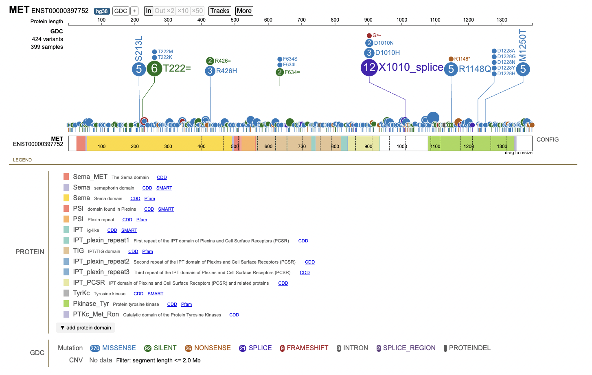
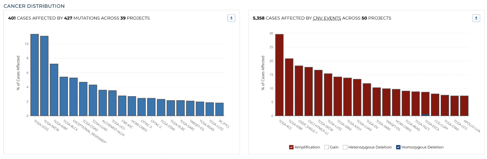
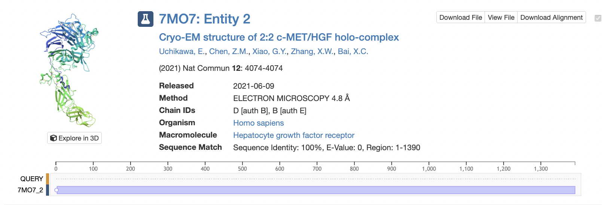

> Q1. What protein do these sequences correspond to? (Give both full gene/protein name and official symbol).

I ran a BLASTp search against RefSeq_Protein and filtered to Homo Sapiens only. RID: V38BY50F014 

Protein Name: Epidermal Growth Factor Receptor (EGFR),
Symbol: MET

> Q2. What are the tumor specific mutations in this particular case ( e.g. A130V)?

```{r}
library(bio3d)

# Read my sequence
a <- read.fasta("A17423250_mutant_seq.fa")
```

We can score conservation per sequence position
```{r}
conserv(a)
```


```{r}
healthy <- a$ali[1,]
tumor <- a$ali[2,]

mut_pos <- which(healthy != tumor)

mutations <- paste0(healthy[mut_pos], mut_pos, tumor[mut_pos])

mutations
```

> Q3. Do your mutations cluster to any particular domain and if so give the name and PFAM id of this domain? Alternately note whether your protein is single domain and provide it’s PFAM id/accession and name (e.g. PF00613 and PI3Ka).

UniProt was used and PFam domain analysis of the hepatocyte growth factor receptor (MET) shows several domains, including the *protein tyrosine kinase domain (Accession: PF07714)* spanning amino acid residues 1078–1336. 

The tumor-specific mutations identified in this sequence are D1164V, F1184E, P1246R, and L1297Y, which occur at positions 1164, 1184, 1246, and 1297, respectively. Each of these mutation positions falls within the range of the protein tyrosine kinase domain (1078–1336). Because all observed mutations occur within this domain, the mutations are clustered in the protein tyrosine kinase domain (PF07714). This domain is responsible for the catalytic activity of the MET receptor, so mutations occurring within this region can potentially alter kinase activity and contribute to oncogenic signaling.

> Q4. Using the NCI-GDC list the observed top 2 missense mutations in this protein (amino acid substitutions)?

Using the NCI Genomic Data Commons mutation distribution (lollipop) plot for the MET protein, the two most frequent missense substitutions observed are M1250T and R1148Q, each occurring in 5 cancer samples. These mutations occur within the kinase domain of MET, a region critical for receptor signaling. The lollipop plot can be seen below.



> Q5. What two TCGA projects have the most cases affected by mutations of this gene? (Give the TCGA “code” and “Project Name” for example “TCGA-BRCA” and “Breast Invasive Carcinoma”).

According to the NCI Genomic Data Commons cancer distribution data, the two TCGA projects with the highest number of cases affected by MET mutations are TCGA-UCEC (Uterine Corpus Endometrial Carcinoma) and TCGA-SKCM (Skin Cutaneous Melanoma). The bar chart distribultion can be seen below:



> Q6. List one RCSB PDB identifier with 100% identity to the wt_healthy sequence and detail the percent coverage of your query sequence for this known structure? Alternately, provide the most similar in sequence PDB structure along with it’s percent identity, coverage and E-value. Does this structure “cover” (i.e. include or span the amino acid residue positions) of your previously identified tumor specific mutations?

```{r}
paste(a$ali[1,], collapse="")
```
A sequence search of the RCSB Protein Data Bank identified PDB structure 7MO7, which corresponds to the hepatocyte growth factor receptor (MET) in complex with its ligand HGF. The structure shows 100% sequence identity with the query sequence and covers residues 1–1390, corresponding to essentially the full length of the protein. Because the structure spans this entire region, it covers all of the identified mutation sites (D1164V, F1184E, P1246R, and L1297Y).



